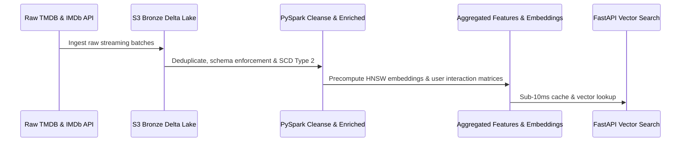

# Databricks Medallion Dataflow Sequence

```mermaid
sequenceDiagram
    participant TMDB as Raw TMDB & IMDb API
    participant Bronze as S3 Bronze Delta Lake
    participant Silver as PySpark Cleanse & Enriched
    participant Gold as Aggregated Features & Embeddings
    participant Serve as FastAPI Vector Search

    TMDB->>Bronze: Ingest raw streaming batches
    Bronze->>Silver: Deduplicate, schema enforcement & SCD Type 2
    Silver->>Gold: Precompute HNSW embeddings & user interaction matrices
    Gold->>Serve: Sub-10ms cache & vector lookup
```
